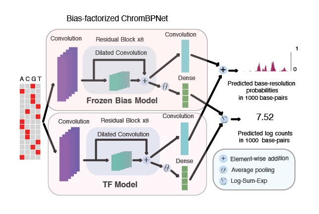

# ChromBPNet: Deep learning models of base-resolution chromatin profiles
                This repo is under construction. Please check back in a week

- This repo contains code for the chrombpnet paper Anusri Pampari*, Anna Shcherbina*, Anshul Kundaje. (*authors contributed equally to the work)  
- Most have these scripts have been derived from an earlier repo (KerasAC) made by Anna Scherbina.
- General queries/thoughts have been addressed in the discussion section below.
- Please contact [Anusri Pampari] (\<first-name\>@stanford.edu)  for suggestions and comments. More instructions about reporting bugs detailed below.

## Quick Links

- [About](#chrombpnet)
- [Installation](#installation)
- [Tutorial](#tutorial-on-how-to-train-chrombpnet-models)
    - [Preprocessing](#preprocessing)
    - [Train and Evaluate Bias Model](#train-and-evaluate-bias-model)
    - [Train and Evaluate ChromBPNet Model](#train-and-evaluate-chrombpnet-model)
- [Variant Effect Prediction](#variant-effect-prediction)
- [Generate Genome Wide Browser Tracks](#generate-genome-wide-browser-tracks)
- [Invivo Footprinting](#invivo-footprinting)
- [Discussion](#discussion)
- [Report a bug](#chrombpnet-bugs)

##  ChromBPNet

Chromatin profiles (DNASE-seq and ATAC-seq) exhibit multi-resolution shapes and spans regulated by co-operative binding of transcription factors (TFs). This complexity is further difficult to mine because of confounding bias from enzymes (DNASE-I/Tn5) used in these assays. Existing methods do not account for this complexity at base-resolution and do not account for enzyme bias correctly, thus missing the high-resolution architecture of these profile. Here we introduce ChromBPNet to address both these aspects.

ChromBPNet (shown in the image as `chrombpnet model`) is a fully convolutional neural network that uses dilated convolutions with residual connections to enable large receptive fields with efficient parameterization. It also performs automatic assay bias correction in two steps, first by learning simple model on chromatin background that captures the enzyme effect (called `bias model` in the image). Then we use this model to regress out the effect of the enzyme from the ATAC-seq/Dnase-seq profiles. This two step process ensures that the sequence component of the ChromBPNet model (called `sequence model`) does not learn enzymatic bias. 



If you are interested in learning more about the detailed architctures used, please refer to the following architecture files - 

- bias model:
- chrombpnet model:

##  Tutorial on how to train chrombpnet models

Here we provide a step-by-step guide to training and evaluating chrombpnet models using the GM12878 ATAC-seq data (ENCSR095QNB) [here][url1].


###  Preprocessing

#### Step 1: Download experimental data

We will first start by creating a directory named `data` and downloading the corresponding files (bams, overlap and idr peak sets) for ENCSR095QNB ENCODE dataset. 
```
bash step1_download_bams_and_peaks.sh

```

(define overlap and idr)

#### Step 2: Make 


#### Step 3: 


###  Train and Evaluate Bias Model


#### Step 4: Train Bias Model


#### Step 5: Interpret bias model


#### Step 6: Scale bias model


###  Train and Evaluate ChromBPNet Model


#### Step 7: Train ChromBPNet Model (This step will also generate the sequence model)


#### Step 8: Interpret chrombpnet model and sequence model


#### Step 9: Marginal footprinting using bias, chrombpnet ans sequence model


##  Variant Effect Prediction

## Generate Genome Wide Browser Tracks


##  Discusssion


##  ChromBPNet bugs


[url1]: https://www.encodeproject.org/experiments/ENCSR095QNB/
